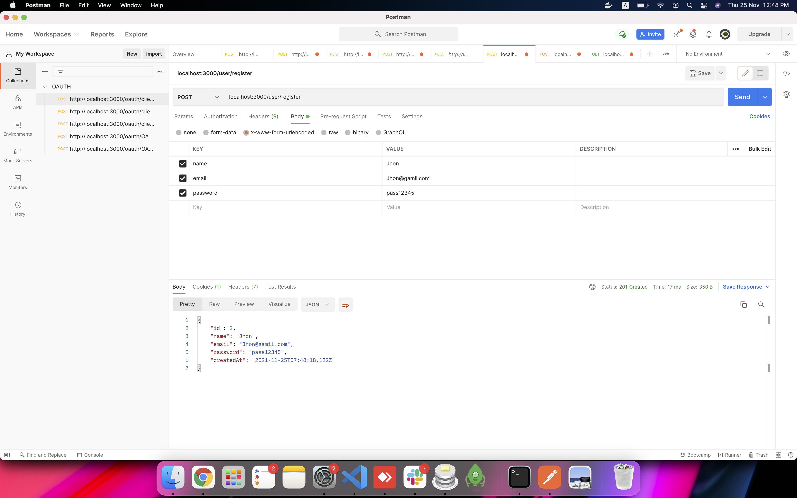
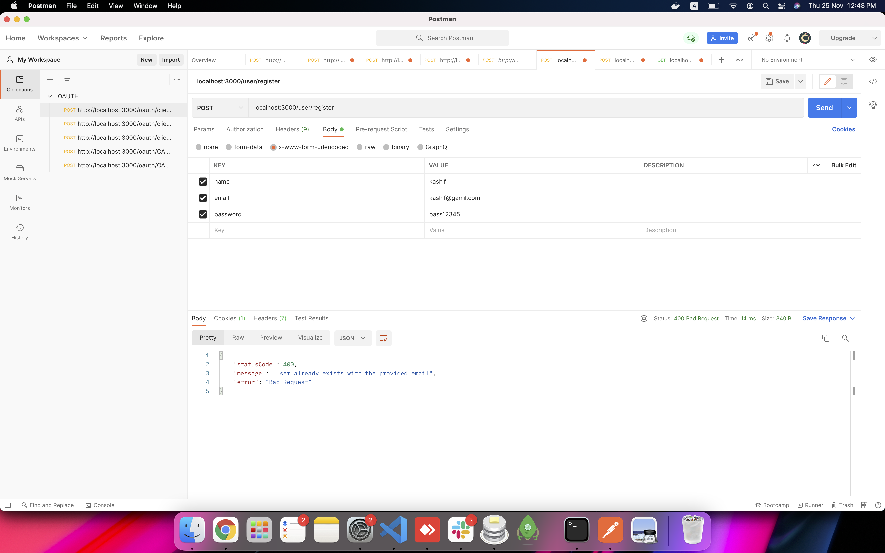
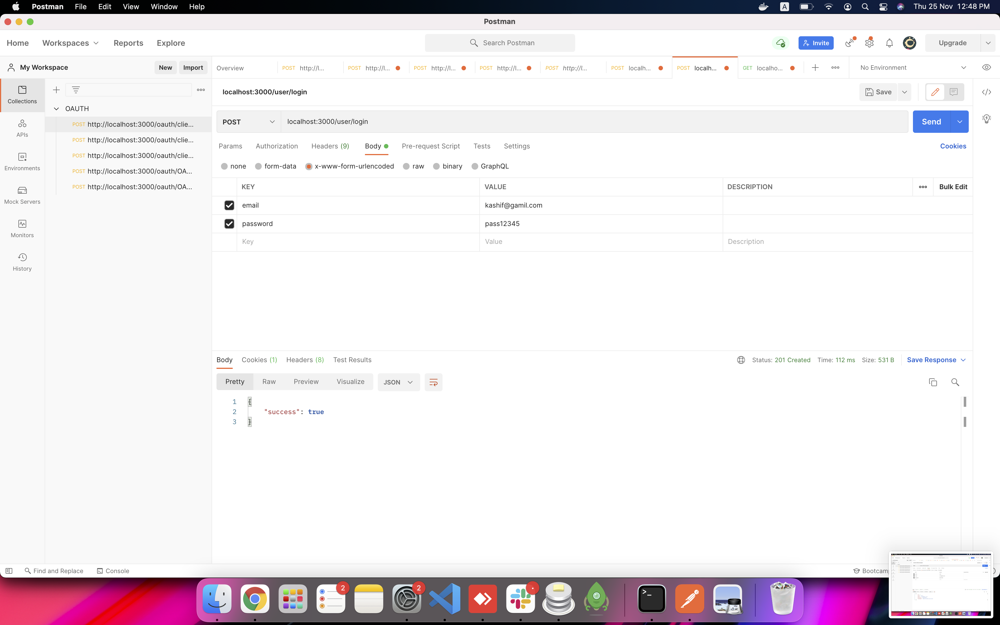
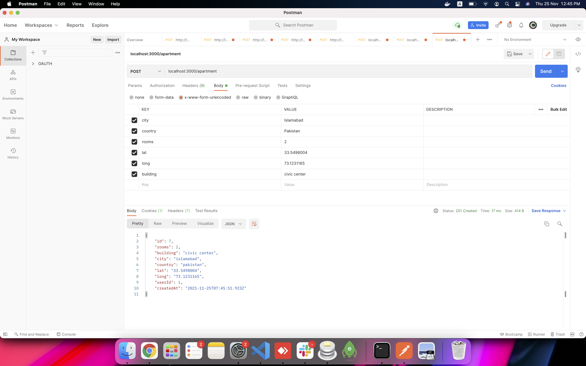
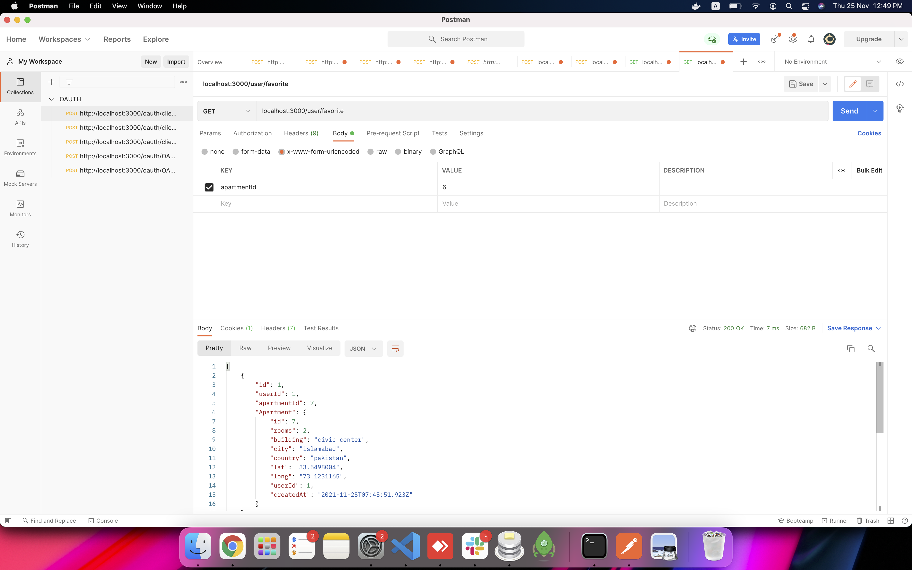
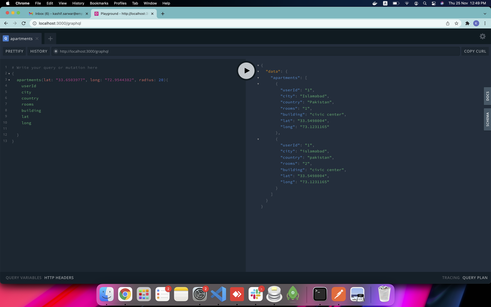

## Description

This application built using NestJS, Prisma, GraphQL and Sqlite as DB and JWT is used for Authentication.
Images are added in public folder for the reference.
Node version required to run is Node 12 or above

## Installation

```bash
$ yarn install
```

## Running the app

```bash
$ yarn start dev
```

## API Details

```bash
POST    localhost:3000/user/register
name
email
password




POST    localhost:3000/user/login
email
password



POST    localhost:3000/apartment
city
country
rooms
building
lat
long


GET     localhost:3000/apartment?lat=33.6503977&long=72.9544382&city=islamabad&radius=20
lat
long
city
country
radius


POST     localhost:3000/user/favorite
apartmentId


GET     localhost:3000/user/favorite


GraphQL Example

```
